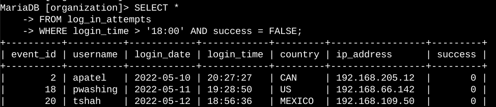
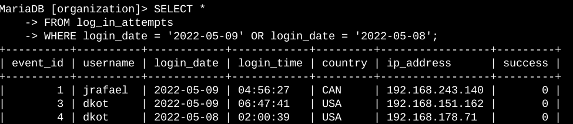
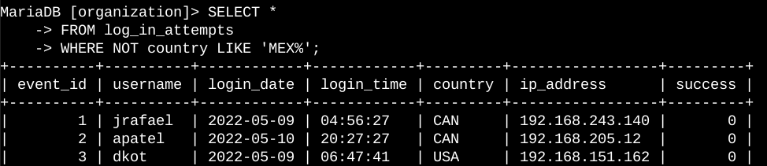
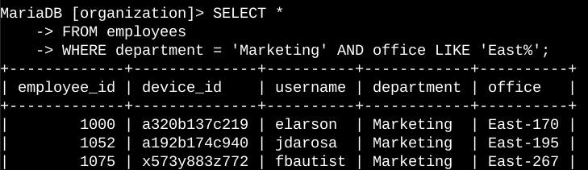
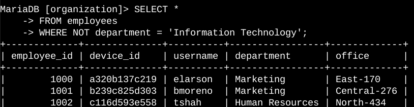

# Apply filters to SQL queries

## Project description

 My company is attempting to strengthen the security of its system. It is my responsibility to make sure the system is secure, look into any possible security flaws, and update staff PCs as necessary. I've included examples of how to utilise SQL with filters for security-related tasks in the following steps.

## Retrieve after hours failed login attempts

 A possible security incident happened after work hours, specifically after 18:00. Every unsuccessful attempt to log in after hours needs to be looked into.

 I constructed a SQL query to filter for unsuccessful login attempts that happened after business hours, as you can see by looking at the code below.

 My query appears in the first section of the screenshot, and some of the output appears in the second. This search looks for unsuccessful attempts at login that had place after 18:00. I began by pulling all of the information out of the log_in_attempts table. I then filtered my findings using a WHERE clause and an AND operator to only show login attempts that were failed and happened after 18:00. Login attempts made after 18:00 are filtered out by the first criteria, login_time > '18:00'. Success = FALSE is the second criterion, which filters for unsuccessful login attempts.

## Retrieve login attempts on specific dates

 The date of the suspicious incident was 2022-05-09. It is necessary to look into any login activity that occurred on 2022-05-09 or the day prior.

 I constructed a SQL query to filter for login attempts that happened on particular dates, as you can see from the code below.

 My query appears in the first section of the screenshot, and some of the output appears in the second. All login attempts made on 2022-05-09 or 2022-05-08 are returned by this query. I began by pulling all of the information out of the log_in_attempts table. Next, I filtered my findings to only show login attempts made on either 2022-05-08 or 2022-05-09 using a WHERE clause and an OR operator. Login_date = '2022-05-09' is the first condition that filters for logins on 2022-05-09. Login_date = '2022-05-08' is the second condition that filters for logins on 2022-05-08.

## Retrieve login attempts outside of Mexico

 I think there is a problem with the login attempts that happened outside of Mexico after looking into the organization's login attempt data. An inquiry into these login attempts is warranted.

 I constructed a SQL query to filter for login attempts that happened outside of Mexico, as you can see from the code below.

 My query appears in the first section of the screenshot, and some of the output appears in the second. All login attempts made in nations other than Mexico are returned by this query. I began by pulling all of the information out of the log_in_attempts table. Subsequently, I employed a WHERE clause with NOT to exclude all nations except Mexico. Since the dataset refers to Mexico as MEX and MEXICO, I used LIKE with MEX% as the pattern to match. When used with LIKE, the percentage symbol (%) signifies any amount of undefined characters.

## Retrieve employees in Marketing

 The marketing department's staff members' laptops need to be updated, according to my team. I need information on which employee machines to update before I can accomplish this.

 The code that follows shows how I constructed a SQL query to look for employee machines among the staff members in the East building's Marketing department.

 My query appears in the first section of the screenshot, and some of the output appears in the second. This search yields the names of every worker in the East building's Marketing division. I began by choosing every piece of information from the workers table. I then filtered for workers who are employed by the Marketing division and in the East building using a WHERE clause with AND. Since the data in the office column shows the East building with the particular office number, I used LIKE with East% as the pattern to match. The department = 'Marketing' component, which filters for staff members in the Marketing department, is the initial criterion. The office LIKE 'East%' part, which screens for workers in the East building, is the second need.

## Retrieve employees in Finance or Sales

 It's also necessary to upgrade the machines used by the staff members of the finance and sales departments. I can only receive personnel data from these two departments because I need a different security update.

How I constructed a SQL query to filter for employee machines from employees in the Finance or Sales divisions is shown in the code below.

 My query appears in the first section of the screenshot, and some of the output appears in the second. All of the personnel in the Finance and Sales departments are returned by this query. I began by choosing every piece of information from the workers table. I then filtered for workers in the Finance and Sales departments using a WHERE clause with OR. Because I want all employees who are in either department, I used the OR operator rather than the AND operator. To filter for personnel in the Finance department, the initial condition is department = 'Finance'. Department = 'Sales' is the second criteria that selects workers in the Sales department.

## Retrieve all employees not in IT

For staff members who do not work in the information technology department, my team needs to update security one more time. I need to gather information about these employees before I can make the edit.

The following shows how I constructed a SQL query to exclude employees who are not part of the IT department from the employee machine filter.

 My query appears in the first section of the screenshot, and some of the output appears in the second. All employees who are not in the information technology department are returned by the query. I began by choosing every piece of information from the workers table. I then filtered for employees that weren't in this department using a WHERE clause with NOT.

## Summary

 I used SQL query filters to obtain certain data about employee computers and login attempts. I made use of the employees and log_in_attempts tables. I filtered for the precise data required for each task using the AND, OR, and NOT operators. In order to look for patterns, I also used LIKE and the wildcard percentage indicator (%).
