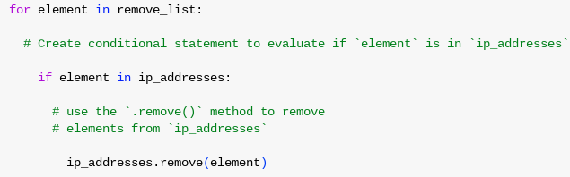
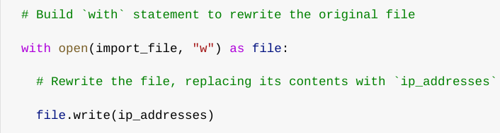

# Update a file through a Python algorithm

## Project description

An allow list of IP addresses is used at my company to manage access to content that is forbidden. These IP addresses are identified in the "allow_list.txt" file. The IP addresses that ought to be blocked from accessing this content are listed in a separate delete list. I developed an algorithm to automatically remove these IP addresses that shouldn't be able to access the "allow_list.txt" file and update it.

## Open the file that contains the allow list

## For the first part of the algorithm, I opened the "allow_list.txt" file. First, I assigned this file name as a string to the import_file variable

  

Then, I used a with statement to open the file:

The allow list file is opened for reading in my algorithm by using the with statement and the read-only.open() function. I'm accessing the file so I may access the IP addresses that are kept in the allow list file. By exiting the with statement and closing the file, the with keyword will aid in resource management. Two parameters are passed to the open() function in the code that uses open(import_file, "r") as file:. The first specifies which file has to be imported, and the second tells me what I want to do with it. "r" in this instance denotes my want to read it. Additionally, the code assigns a variable called file using the as keyword; file holds the result of the.open() method while I'm working inside the with statement.

## Read the file contents

In order to read the file contents, I used the .read() method to convert it into the string.

  

I can call the.read() method in the body of the with statement when I use an.open() function that takes the argument "r" for "read." I can read the file by converting it to a string using the.read() method. I used the with statement's file variable to apply the.read() method. I then set the variable ip_addresses to contain the textual output of this procedure.

To put it briefly, this function reads the data from the "allow_list.txt" file and converts it into a string format that I can use in my Python application to organise and extract data.

## Convert the string into a list

I required the list format in order to remove certain IP addresses from the allow list. As a result, I then turned the string representing the IP addresses into a list using the.split() method:

  

By appending the.split() function to a string variable, it can be called. It functions by turning a string's contents into a list. To make removing IP addresses from the allow list simpler, ip_addresses has been divided into a list. The.split() function divides text by whitespace into list elements by default. The data kept in the variable ip_addresses, which is a string of IP addresses separated by whitespace, is sent into the.split() function in this algorithm, which turns it into a list of IP addresses. I returned this list to the variable ip_addresses in order to store it.

## Iterate through the remove list

Iterating through the IP addresses that are components of the remove_list is a crucial component of my approach. I used a for loop in order to accomplish this:

  

Python's for loop repeats code for a given sequence. In a Python method such as this one, the for loop's main goal is to apply particular code instructions to each element in a series. The for loop is started with the for keyword. The keyword in and the loop variable element come next. The keyword in instructs the loop variable element to assign each value as iterates through the series of IP addresses.

## Remove IP addresses that are on the remove list

Any IP address that appears in remove_list and the allow list, ip_addresses, must be removed according to my method. I could use the following code to accomplish this because ip_addresses did not contain any duplicates:

  

I started by adding a conditional to my for loop to determine whether the loop variable element could be found in the ip_addresses array. I took this action since.remove() would fail when used on components that weren't located in ip_addresses.

After that, I applied.remove() to ip_addresses inside of the conditional. To ensure that every IP address in the remove_list was eliminated from ip_addresses, I supplied the loop variable element as an argument.

## Update the file with the revised list of IP addresses

I had to update the allow list file with the updated list of IP addresses as the last stage in my method. I have to first turn the list back into a string in order to accomplish this. For this, I employed the.join() method:

  

An iterable's components are all combined into a string using the join() method. When a string is joined together, the characters in the string that make up the iterable's elements are separated using the.join() method. In this approach, I created a string from the list of IP addresses using the join() function so that I could provide it as an argument to the write() method and write to the "allow_list.txt" file. The separator that I used to tell Python to start a new line for each element was the string ("n").

Next, I updated the file using a second with statement and the.write() method:

This time, I used the open() method in my with statement with a second argument of "w". I want to open a file so I can write over its contents, as this argument suggests. I can invoke the.write() function in the with statement's body by utilising this parameter, "w". The.write() function replaces any existing file content and writes string data to a given file.

In this instance, I intended to send the updated allow list to the "allow_list.txt" file in the form of a string. In this manner, any IP addresses that were taken off the allow list will no longer be able to access the restricted content. I added the.write() function to the file object file that I specified in the with statement in order to overwrite the file. To indicate that the contents of the file mentioned in the with statement should be replaced with the data in this variable, I entered the ip_addresses variable as the parameter

## Summary

I developed an algorithm that eliminates IP addresses from the "allow_list.txt" file of permitted IP addresses that are found in a remove_list variable. This algorithm read the file, converted it to a string that could be read, and then turned the string into a list that was kept in the ip_addresses variable. After that, I went through each IP address in remove_list one by one. I determined whether the element was included in the list of IP addresses with each iteration. If so, I removed the element from ip_addresses using the.remove() method. Subsequently, I employed the.join() function to transform the IP addresses back into a string, enabling me to append the updated list of IP addresses to the "allow_list.txt" file's contents.