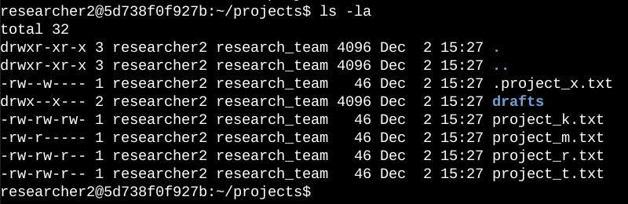
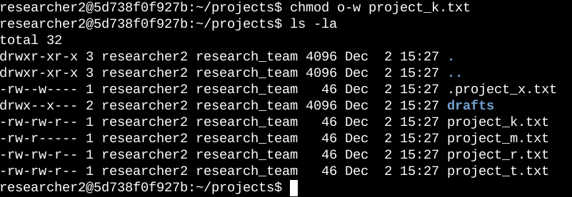
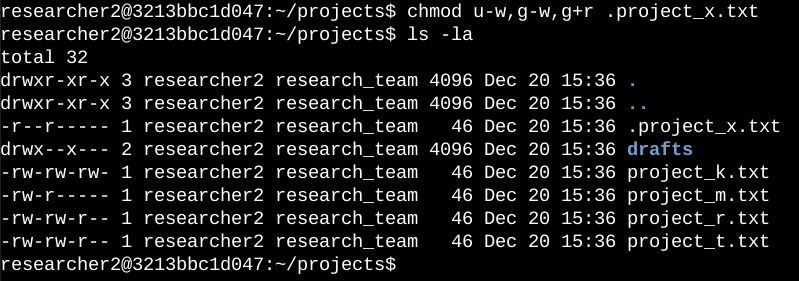
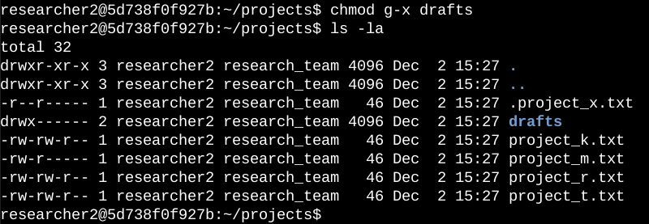

# File permissions in Linux

## Project description

The projects directory contains files and folders that require the file permissions to be updated by the research team at my organisation. Right now, the permissions do not correspond to the appropriate level of authority. Their system will remain secure if these permissions are checked and updated. I completed the following tasks to finish this task:

## Check file and directory details

The code that follows shows how I was able to find the current permissions assigned for a particular directory in the file system using Linux commands.

  

The command I typed is shown in the first line of the screenshot, and the output is shown in the remaining lines. The projects directory's contents are all listed in the code. I was able to see a comprehensive list of the file contents—which included hidden files—by using the **ls** programme with the **\-la** option. My command produced the following output: one secret file called_.project_x.txt_, five other project files, and a subfolder called _drafts_. The permissions assigned on each file or directory are represented by the 10-character string in the first column.

## Describe the permissions string

The 10-character string can be deconstructed to determine who is authorized to access the file and their specific permissions. The characters and what they represent are as follows:

- **1st character**: The first letter denotes the kind of file and can be either a **d** or a hyphen **_(-)_**. It is a directory if it is a **d**. It is a regular file if there is a hyphen **_(-)_**.
- **2nd-4th characters**: The read **(r)**, write **(w),** and execute **(x)** permissions for the user are indicated by these characters. If one of these characters is a hyphen **_(-)_**, the user is not granted permission for this use.
- **5th-7th characters:** The read **(r)**, write **(w),** and execute **(x)** permissions for the group are indicated by these characters. If one of these characters is a hyphen (-) instead, it means that the group is not eligible for this permission.
- **8th-10th characters:** The read **(r)**, write **(w)**, and execute **(x)** rights for others are indicated by these characters. All other users on the system excluding the user and the group make up this owner type. In the event that one of these characters is a hyphen (-), it signifies that permission for other characters is not given.

Project_t.txt, for instance, has file permissions of _\-rw-rw-r--. Project_t.txt_ is a file, not a directory, as shown by the hyphen **_(-)_** that appears in the first character. The characters **_r_** in the second, fifth, and eighth positions signify that read permissions are granted to the user, group, and other. Only the user and group have write rights, as indicated by the third and sixth characters, which are **w**. For _project_t.txt_, no one has execute permissions.

## Change file permissions

The company concluded that no one else should be able to write to any of their files. I used the file permissions that I had previously returned to comply with this. I found that the write access to _project_k.txt_ needs to be deleted for other users.

The following code demonstrates how I used Linux commands to do this:

  

The commands I typed are shown in the first two lines of the screenshot, and the result of the second command is shown in the remaining lines. The permissions of files and directories can be modified with the **chmod** command. The file or directory is specified by the second argument, while the first argument defines which permissions need to be adjusted. For the _project_k.txt_ file in this example, I deleted the write permissions from other. I then used **ls -la** to examine the changes I had made.

## Change file permissions on a hidden file

_Project_x.txt_ was recently archived by my organization's research team. The user and group should have read access to this project; they do not want anyone to have write access.

The following code demonstrates how I used Linux commands to change the permissions:

  

The commands I typed are shown in the first two lines of the screenshot, and the result of the second command is shown in the remaining lines. I am aware. Because _project_x.txt_ begins with a period _(. ),_ it is a hidden file. In this example, I gave the group read permissions and took away the user's and group's write capabilities. I took away the user's **u-w** write permissions. Next, I gave the group with **g+r** read capabilities and withdrew write permissions from it.

## Change directory permissions

The _researcher2_ user should only have access to the drafts directory and its contents, per our organization's policy. This indicates that execute permissions should only be granted to _researcher_ 2.

The following code demonstrates how I used Linux commands to change the permissions:

  

The commands I typed are shown in the first two lines of the screenshot, and the result of the second command is shown in the remaining lines. I used the **chmod** command to remove the group's execute permissions after discovering earlier that they were there. It was not necessary to add execute rights because the _researcher2_ user already has them.

## Summary

I made numerous changes to permissions in order to provide files and directories in the projects directory the level of access that my organisation required. Checking the directory's permissions with **ls -la** was the initial step in this process. This helped me make decisions about what to do next. I then changed the permissions of files and directories several times using the **chmod** command.